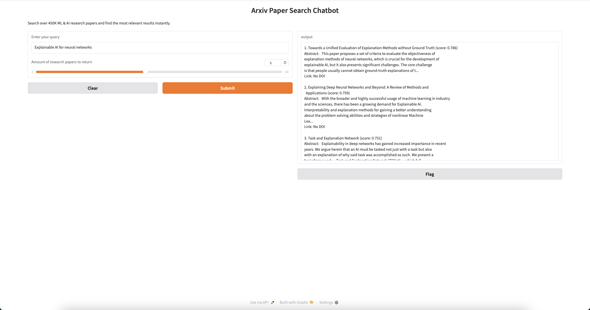

# ScholAI

<div align="center">
  
</div>

This project allows you to semantically search through a large collection of research papers (mainly ML/AI) and retrieve relevant abstracts using embeddings and Pinecone. The interface is powered by Gradio for an interactive chatbot-like experience.

## Features

- Query your database of research papers using natural language.
- Retrieve top relevant papers based on semantic similarity.
- Minimal setup and easy to run locally.
- Uses `SentenceTransformer` embeddings and Pinecone for vector search.

## Setup & Run

> ⚠️ Note: This is a local SQLite database.  
> For privacy and data storage reasons, if you want to use this data in a vector database like Pinecone, you’ll need to convert the paper text into embeddings (e.g., using MiniLM).  
> Once converted, you can store only the embeddings and metadata, without exposing the raw text.

### 1. Download the database

First, download the `.db` and `.npy` files containing the research paper data:

[arxiv_papers.db](https://drive.google.com/file/d/150bo01vc0Xx49nsPhqtjGM4-XsUNL1EG/view?usp=sharing)
[arxiv_embeddings.npy](https://drive.google.com/file/d/1qkOnO9Yy9rxZrRyHhHrk28R2-ND57fhc/view?usp=sharing)

### 2. Import Embeddings into Pinecone

1. **Create a Pinecone account**
   - Go to [https://www.pinecone.io](https://www.pinecone.io) and sign up.

2. **Upload the embeddings file**
   - Upload `arxiv_embeddings.npy` to your Pinecone index.  
   - The file name in Pinecone doesn’t matter—just make sure the vectors are upserted.

3. **Set your Pinecone API key**
   - In `arxiv.py`, replace the placeholder for the API key:
   ```python
   import os
   os.environ["PINECONE_API"] = "YOUR_API_KEY_HERE"

### 3. Run the program
```bash
python run.py

```

4. Copy the Gradio link from the terminal

```bash
# Example output:
# (base) srivatsansureshbabu@S345003 FineTuningGPT % python run.py
# * Running on local URL:  http://99.0.0.4:2222
# * To create a public link, set `share=True` in `launch()`.
```
